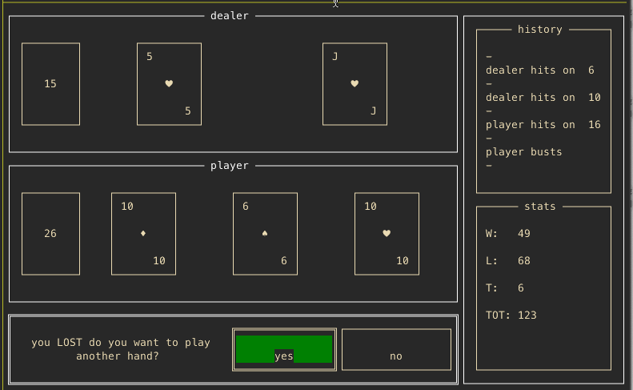

# cardz

implements a model for a deck of cards, and also has a command line blackjack
game that uses that model.

planning to add some more notes here later, but this is what the game looks like:

